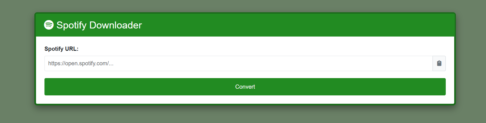
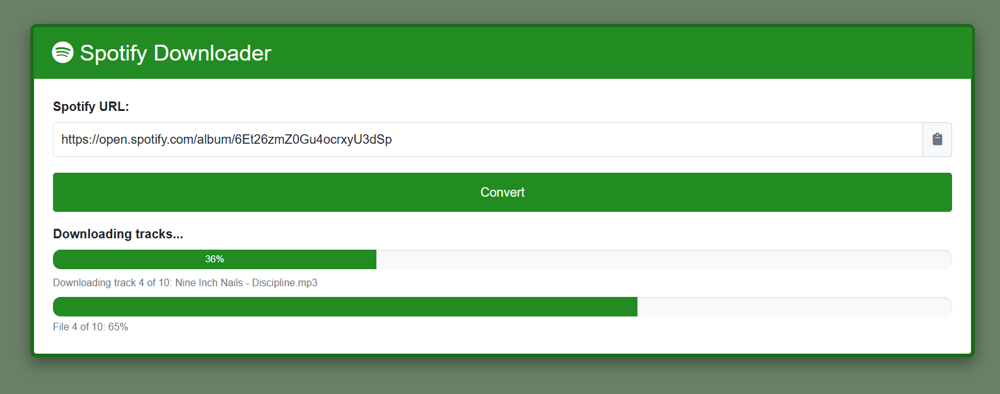
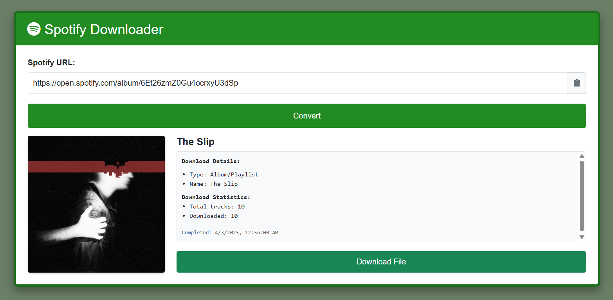

# (Spotdl) Spotify Downloader Web App Installation Guide
Self-hosted web GUI for Spotify URL downloader

## Overview
This web application allows users to download Spotify tracks, albums, and playlists as MP3 files through a browser interface. It uses Flask as the web server, connects to Spotify's API for metadata, and uses yt-dlp to download audio.

## Deployment Steps

### 1. Prepare Environment

```bash
# Create directory for the application
mkdir -p /volume/spotdl
cd /volume/spotdl

# Create virtual environment
python3 -m venv venv
```

### 2. Install Dependencies

```bash
# Activate virtual environment
source venv/bin/activate

# Install dependencies
pip install -r requirements.txt
```

### 3. Configure Spotify API Credentials

```bash
# Create .env file
cat > .env << EOF
SPOTIPY_CLIENT_ID=your_spotify_client_id
SPOTIPY_CLIENT_SECRET=your_spotify_client_secret
SPOTIPY_REDIRECT_URI=http://your_server_ip:7667/callback
FLASK_APP_SECRET=your_random_secret_key
EOF
```

### 4. Create Application Files

Copy the provided files to their proper locations:
- `spotdl.py` → `/volume/spotdl/spotdl.py`
- `spotdl.html` → `/volume/spotdl/spotdl.html`
- `spotdl.sh` → `/volume/spotdl/spotdl.sh`
- `spotdl-service.sh` → `/usr/local/etc/rc.d/spotdl-service.sh`

### 5. Set Permissions

```bash
# Make the shell scripts executable
chmod +x /volume/spotdl/spotdl.sh
chmod +x /usr/local/etc/rc.d/spotdl-service.sh

# Create downloads directory
mkdir -p /volume/spotdl/downloads
```

### 6. Configure Service Script

Edit `/usr/local/etc/rc.d/spotdl-service.sh` to set the correct username:
```bash
# Replace "user" with your actual username
USER="your_username"
```

### 7. Start the Application

#### Option A: Run directly
```bash
cd /volume/spotdl
./spotdl.sh
```

#### Option B: Run as a system service
```bash
# Start the service
sudo /usr/local/etc/rc.d/spotdl-service.sh start

# Check status
sudo /usr/local/etc/rc.d/spotdl-service.sh status
```

### 8. Access the Web Interface

Open a browser and navigate to:
```
http://your_server_ip:7667
```

## Important Notes
- Make sure port 7667 is open in your firewall
- The application logs are stored in `/var/log/spotdl.log`
- Downloaded files are stored in `/volume/spotdl/downloads`
- You need a valid Spotify developer account to get API credentials
- FFmpeg must be installed for audio conversion

## Screenshots





